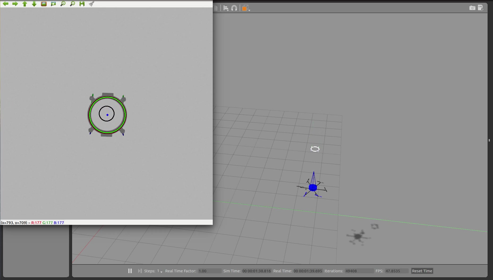

Autonomous In-flight Multi-rotor Docking Simulator
===============

This is a Gazebo simulation to demonstrate an approach to autonomous in-flight docking of unmanned multi-rotor aerial vehicles (MAV). The results of the simulation can be seen [here](https://youtu.be/rB6hydBpABs).

The robotic system consists of two MAVs. The docking MAV is responsible for performing the docking maneuver while the carrier MAV receives the docking MAV. The docking MAV disarms once docking is complete while the carrier MAV stays powered. The carrier MAV is much larger than the docking MAV and approaches it from below. This iteration uses a quadrotor for the docking MAV and a hexarotor for the carrier MAV. The flight control software used on the MAVs is [PX4](https://github.com/PX4/Firmware). The MAVs are autonomously controlled using ROS with Python. ROS communicates to PX4 through the [MAVROS](https://github.com/mavlink/mavros) package.  

A vision and docking system is mounted on the carrier MAV. The docking system consists of a vertical mast attached to the top of the carrier MAV. At the top of the mast, pointed along the z-direction of the carrier MAV, is a monocular camera used by the vision system. The frame of the docking MAV is ring-shaped to receive the mast. The underside of the frame of the docking MAV has a red strip to represent what would be a LED fiducial markers. The vision algorithms used for detection and tracking of the docking MAV were programmed using OpenCV with Python.

